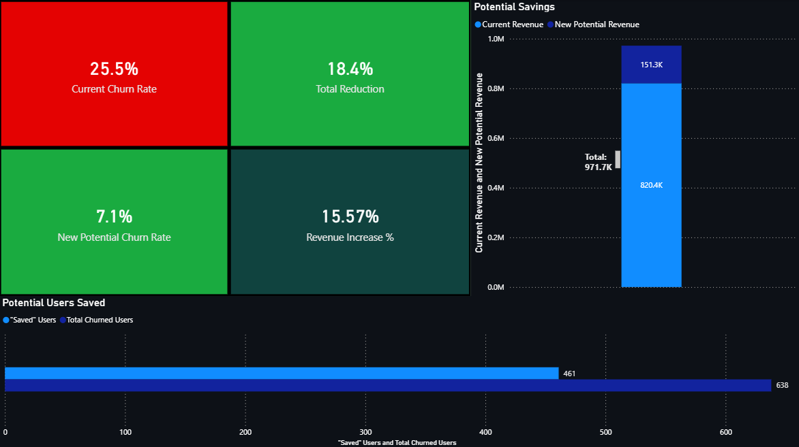
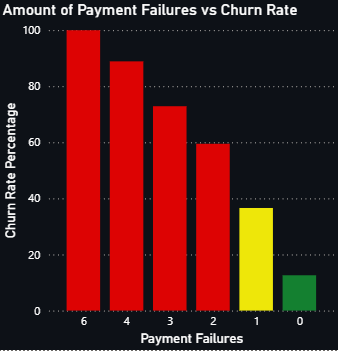
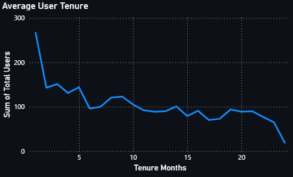
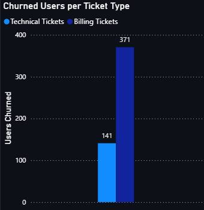
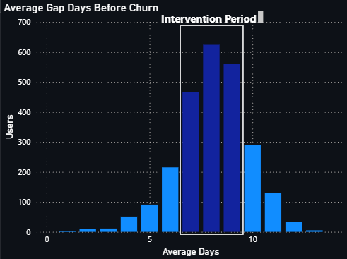

# SaaS Customer Churn Analysis



## What This Project Does

Here I analyze a SaaS company struggling with high customer churn despite having a solid product. Through SQL analysis of subscription data, support tickets, billing failures, and usage patterns, I identified the root causes and built an intervention strategy that could reduce churn by 72% and retain $151K in annual revenue.

## The Problem

The company should be retaining customers—they've got competitive pricing and active usage. But they're losing 25.5% of customers annually (industry benchmark is 10-15%). Something wasn't adding up, so I dug into the data to find out what.

## Tools I Used

- **SQLite** - All the data analysis, joins, CTEs, and aggregations
- **Python** - Data generation and expansion (created 4 additional fact tables)
- **Power BI** - Built all visualizations and executive dashboard
- **Excel** - Scenario testing and projection modeling

## How I Approached It

I started with a single customer behavior table and expanded it into a full star schema with billing, support, and usage tracking (more on that in the [data dictionary](data_dictionary.md)). Then I:

1. Calculated baseline churn rate and compared to industry benchmarks
2. Analyzed support ticket volume and severity by churn status
3. Identified payment failure patterns and their impact on retention
4. Examined customer tenure to find critical onboarding periods
5. Mapped user inactivity windows preceding churn
6. Quantified the revenue impact of targeted interventions

The full step-by-step process is in my [analysis walkthrough](analysis.md).

## What I Found

### Payment Failures Are the #1 Churn Driver



Payment failures create a cascading disaster. Unlike technical bugs that users can work around, payment issues lock them out entirely:
- 1 failure = 36.6% churn risk
- 2 failures = 60% churn risk  
- 3 failures = 75% churn risk
- 4+ failures = 90% churn risk

This isn't about users choosing to leave—it's about the system forcing them out.

**See the query:** [`06_payment_failure_churn.sql`](SQL/06_payment_failure_churn.sql)

### Onboarding Is Broken



New customers experience 40-49% monthly churn during months 1-5. But users who survive this gauntlet show strong retention (≤20%). The problem isn't long-term value—it's that new users encounter too many issues during the critical evaluation period when tolerance for friction is minimal.

**See the query:** [`07_tenure_churn_rate.sql`](SQL/07_tenure_churn_rate.sql)

### Churned Users Submit 3x More Support Tickets



Churned users average 6.4 tickets vs 2.3 for active users. But it's not just volume—it's what they're experiencing:
- 18-20% of all tickets are high severity (product quality issue)
- Billing tickets drive higher churn than technical tickets
- Users eventually give up: ticket volume drops right before churn

Churn threshold: **3 billing tickets OR 4-5 technical tickets**

**See the queries:** [`03_churn_analysis.sql`](SQL/03_churn_analysis.sql), [`09_technical_ticket_churn.sql`](SQL/09_technical_ticket_churn.sql)

### There's a 7-9 Day Intervention Window



47% of churned users show 7-9 days of inactivity before churning. This is an actionable signal—these users haven't left yet, but they're on the edge. Proactive outreach during this window (satisfaction surveys, support offers, feature tutorials) could recover at-risk customers.

**See the query:** [`10_gap_before_churn.sql`](SQL/10_gap_before_churn.sql)

### Support Speed Isn't the Problem

Resolution times are evenly distributed between churned and active users. If anything, active users wait slightly longer. The issue isn't how fast support responds—it's that users shouldn't need support this often in the first place. This is a product quality problem, not a support problem.

**See the query:** [`05_avg_resolution_time.sql`](SQL/05_avg_resolution_time.sql)

## What They Should Do

### Priority 1: Fix Billing Infrastructure (Critical)

Immediately halt new feature development for 2-4 weeks and address payment processing failures. Target: reduce failures from current rate to <5%. This is the highest ROI intervention—payment issues cause 75-90% churn at 3+ failures.

### Priority 2: Improve Onboarding Experience (High)

Target months 1-3 where churn peaks at 40-49%. Focus on eliminating critical bugs that new users encounter during the evaluation period. Users who survive the first 5 months show strong retention—the goal is getting more people past this threshold.

### Priority 3: Implement Proactive Intervention System (Medium)

Deploy automated alerts for:
- Users with 1+ payment failures (36.6% churn risk)
- 7-9 day login gaps (47% of churned users show this pattern)
- Users approaching 3 technical tickets (before hitting the 88.7% churn threshold at 4-5 tickets)

Each intervention gives the company a chance to save the customer before they hit the point of no return.

## The Numbers

| Metric | Before Intervention | After Intervention |
|--------|---------------------|-------------------|
| Churn rate | 25.5% | 7.1% |
| Annual revenue | $820,440 | $971,729 |
| Customers saved annually | 0 | 627 customers |
| High-severity tickets | 18-20% of all tickets | Reduced through proactive intervention |
| Payment failure impact | 3 failures = 75% churn | Target: <5% failure rate |
| Early-stage churn (months 1-5) | 40-49% monthly | Target: <20% monthly |

**See the projections:** [`13_predicted_statistics.sql`](SQL/13_predicted_statistics.sql)

## Project Files
```
SaaS-Churn-Rate-Analysis/
├── README.md                           # You're reading it
├── analysis.md                         # Full walkthrough of my process
├── data_dictionary.md                  # Database structure and relationships
├── SQL/                                # All queries (13 total)
│   ├── 01_churn_rate_percentage.sql
│   ├── 02_churn_plan_type.sql
│   ├── 03_churn_analysis.sql
│   ├── 04_ticket_type.sql
│   ├── 05_avg_resolution_time.sql
│   ├── 06_payment_failure_churn.sql
│   ├── 07_tenure_churn_rate.sql
│   ├── 08_billing_ticket_per_failure.sql
│   ├── 09_technical_ticket_churn.sql
│   ├── 10_gap_before_churn.sql
│   ├── 11_current_statistics.sql
│   ├── 12_users_saved.sql
│   └── 13_predicted_statistics.sql
├── Results/                            # Query outputs (CSV)
└── Visualizations/                     # Power BI charts and dashboard
    ├── executive_dashboard.png
    ├── avg_user_tenure.png
    ├── churned_vs_ticket_type.png
    ├── gap_before_churn.png
    ├── payment_failure_vs_churn_rate.png
    └── percentage_of_tickets_by_category.png
```

## Skills This Project Shows

- Writing complex SQL (multi-table joins, CTEs, window functions, aggregations, cohort analysis)
- Database design—expanding a single table into a proper star schema with fact tables
- Root cause analysis—distinguishing symptoms from actual problems
- Predictive modeling—quantifying intervention impact and ROI
- Data visualization that drives business decisions (Power BI)
- Strategic thinking—prioritizing fixes by severity and addressability
- Critical evaluation of data quality (see the data dictionary)

## Data Source

This project uses the [Customer Subscription Churn and Usage Patterns dataset](https://www.kaggle.com/datasets/jayjoshi37/customer-subscription-churn-and-usage-patterns/data) from Kaggle as a starting point. I significantly expanded it by creating 4 additional tables (dim_users, fact_billing, fact_support_tickets, fact_usage_logs) to enable comprehensive churn analysis.

## Contact

**Ryan Bingham**  
[LinkedIn](https://www.linkedin.com/in/ryan-bingham1) | [GitHub](https://github.com/RyanBingham334) | ryanbingham334@gmail.com

---

*This project is available for educational and portfolio purposes.*
